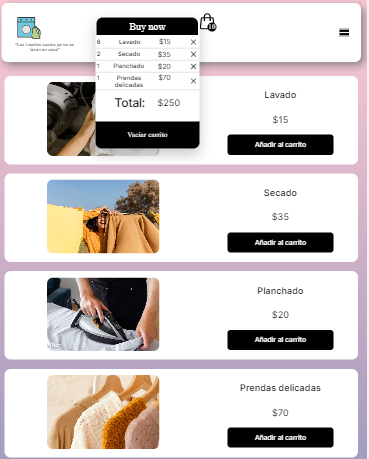

# Lavandería App 🧺

¡Bienvenido a la aplicación frontend de Lavandería! Esta aplicación está diseñada para ayudarte a gestionar tus compras de productos de lavandería de manera eficiente. Aquí encontrarás una breve guía sobre cómo utilizar la aplicación y algunos detalles importantes.



## Características 🌟

- Registro de usuarios ✍️
- Inicio de sesión de usuarios 🔐
- Visualización de productos disponibles 🧼
- Agregar productos al carrito de compras 🛒
- Revisión y confirmación de productos comprados 📦
- Utiliza React, JavaScript, rutas, React Router-DOM, hooks y componentes funcionales 🚀

## Uso 🚀

1. **Registro e Inicio de Sesión**: En la página de inicio, puedes registrarte como nuevo usuario utilizando la API proporcionada en [https://reqres.in/](enlace-a-tu-api-de-registro) o iniciar sesión siguiendo los pasos de la página.

2. **Explora los Productos**: Después de iniciar sesión, serás redirigido a la página principal donde encontrarás una lista de productos de lavandería disponibles para comprar.

3. **Añade Productos al Carrito**: Haz clic en el botón "Añadir al carrito" en los productos que deseas comprar. Puedes agregar múltiples productos. 🛍️

4. **Revisa tu Carrito**: Dirígete al componente "BuyCart" para revisar la lista de productos que has agregado al carrito de compras. Aquí podrás ver una lista detallada de los artículos seleccionados.

5. **Confirma tu Compra**: Una vez que hayas revisado tu carrito de compras, puedes confirmar tu compra haciendo clic en el botón "Buy Now". Serás redirigido a una página de confirmación de productos. 🎉

## Instalación y Ejecución 🛠️

Para ejecutar esta aplicación en tu entorno local, sigue estos pasos:

1. Clona este repositorio en tu máquina local:

   ```bash
   git clone git@github.com:aracely33/laundry-receipt-frontend.git
   ```

2. Navega al directorio del proyecto:

   ```bash
   cd laundry
   ```

3. Instala las dependencias utilizando npm o yarn:

   ```bash
   npm install
   # o
   yarn install
   ```

4. Ejecuta la aplicación:

   ```bash
   npm start
   # o
   yarn start
   ```

La aplicación estará disponible en tu navegador en `http://localhost:3000/`. 🌐

## Contribución 🤝

¡Agradecemos tus contribuciones! Si deseas colaborar en el desarrollo de esta aplicación, por favor, sigue estos pasos:

1. Crea un fork del repositorio.
2. Crea una rama para tu contribución: `git checkout -b mi-contribucion`.
3. Realiza tus cambios y asegúrate de que la aplicación funcione correctamente.
4. Envía un pull request a la rama principal del repositorio. 🚀


## Contacto 📧

Si tienes alguna pregunta o comentario, no dudes en ponerte en contacto con nosotros en [yuki_oh91@hotmail.com]. 📩

¡Gracias por usar la aplicación de Lavandería! 👕👖
```

